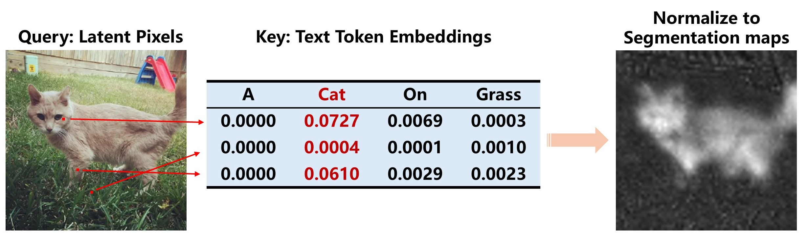
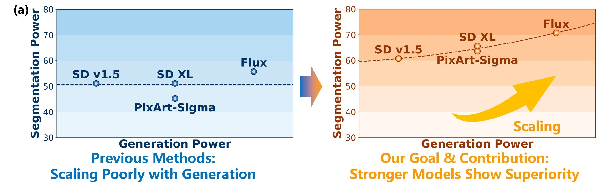

# GoCA: Making Training-Free Diffusion Segmentors Scale with the Generative Power

## Highlight

Training-free diffusion segmentors are a method to exploit the *understanding* potential from a *generative* diffusion model.
For a text-to-image diffusion model, to steer image generation with text, a mechanism called cross-attention is utilized.
In such a module, the Q is latent pixels and the K/V are text tokens, so an attention map is calculated between pixels and tokens.
Then, we can interpret this attention map for segmentation: for all tokens with respect to a certain pixel, the token with the highest score is likely to be the semantic class of this pixel.
This process is depicted in the following figure:  

  

Since this understanding capability is derived from the generation capabiliy of a diffusion model, naturally, we expect a diffusion model stronger at generation to be also stronger at understanding.
However, this is *not* the case, as shown in the figure (left) below.
This is exactly what we want to address in this work, as shown in the figure (right) below.  

  

Our core observation is that two factors have been causing this scaling failure.
- There're actually *many* cross-attention modules in a diffusion backbone, and the maps they produce should be aggregated via weighted average. Conventional methods do this with a set of hand-tuned weights, which becomes impractical in more complex diffusion models. Our solution is to *automatically* derive weights from the numerical relations between diffusion activations.
- The score scales of different tokens are in fact *inconsistent*, making direct comparison of the raw scores not reliable. Previous methods have considered this, but *only partially*. We additionally take the scale of semantic special tokens like \<sos\> into consideration.  

For more details, you are welcome to our paper!  

## Install
**Step 1**: Install [Generic-Diffusion-Feature](https://github.com/Darkbblue/generic-diffusion-feature).  

**Step 2**: Modify Generic-Diffusion-Feature.  
Move install/components into generic-diffusion-feature installation folder. (You may want to backup the original files.)  

**Step 3**: Install DCRF and openai api.
```bash
git clone https://github.com/lucasb-eyer/pydensecrf
cd pydensecrf
pip3 install --force-reinstall cython==0.29.36
python3 setup.py install

pip3 install openai
```
This step can be skipped if you don't need to run the GPT labeling process and don't need to reproduce FTTM results.
If you choose to skip the installation of DCRF, you might run into an error that can be fixed by commenting out the import of dcrf package.  

**Step 4**: Install generation experiment requirements. (Skip this step if you don't need to run this experiment.)  
*You may want to backup the environment into a new one dedicated to the generation experiment, as some of the modifications in this step might conflit with other steps.*  
You need to first install [T2IBenchmark](https://github.com/boomb0om/text2image-benchmark/tree/main) and [T2I-Metrics](https://github.com/QuanjianSong/T2I-Metrics) for evaluation.  
Then copy the content of `generic-diffusion-feature/feature/diffusers/pipeline2/pixart_alpha/pipeline_pixart_sigma_backup.py` into diffusers lib files, *replacing* the content of `pipeline_pixart_sigma.py`.

**Step 5**: Dataset preparation.
- Pascal VOC 2012 http://host.robots.ox.ac.uk/pascal/VOC/voc2012/
- Pascal Context https://cs.stanford.edu/~roozbeh/pascal-context/
- COCO-Object https://cocodataset.org/
- COCO-Stuff https://github.com/nightrome/cocostuff
- Cityscapes https://www.cityscapes-dataset.com/
- ADE20K https://ade20k.csail.mit.edu/

## Repo Structure
```text
src-main/ codes for the standard segmentation benchmarks
src-additional/
	generation-experiment codes for the generation experiment, where GoCA is integrated into S-CFG
	attention-observation.py a handy script for fast debugging and developing
install/ files that need modifying in generic-diffusion-feature
```

## How to Run
### Standard Segmentation Benchmarks
**Step 1**: Choose one dataset from `src-main/configs/config-dataset/` and one model from `src-main/configs/config-model/`. Then copy the file content into `src-main/configs/current_dataset.py` and `src-main/configs/current_model.py`.

**Step 2**: (Optional) Run GPT labeling. (We provide generated labels in `src-main/gpt_output` so you don't need to, though still can, run it again.)
```bash
cd src-main
python3 gpt-labeling.py
# (config src-main/gpt-labeling/merge.py's content)
python3 gpt-labeling/merge.py
```

**Step 3**: Run captioner.
```bash
cd src-main
python3 captioner.py
```

**Step 4**: Run segmentation task.
```bash
cd src-main
python3 main.py
```

### Generation Experiment
**Step 1**: Choose one model from `src-additional/generation-experiment/configs/` and copy the file content into `src-additional/generation-experiment/configs/current_model.py`.  

**Step 2**: Config the settings in `src-additional/generation-experiment/generate_for_fid_15.py` and  `src-additional/generation-experiment/generate_for_fid_sigma.py`.  
Config codes are marked with `CONFIG` in the comment, which you can search to jump to.  

**Step 3**: Run generation task
```bash
cd src-additional/generation-experiment
python3 generate_for_fid_15.py
python3 generate_for_fid_sigma.py
```

**Step 4**: Evaluation

### Attention Observation
We provide a highly customizable script in `src-additional/attention-observation.py`, which extracts and processes cross-attention maps from any customized image and prompt. You can use it as a quick effect validation and dev tool.  
All the configs are directly integrated into the script, put in the top few lines of code.

## Citation
placeholder
